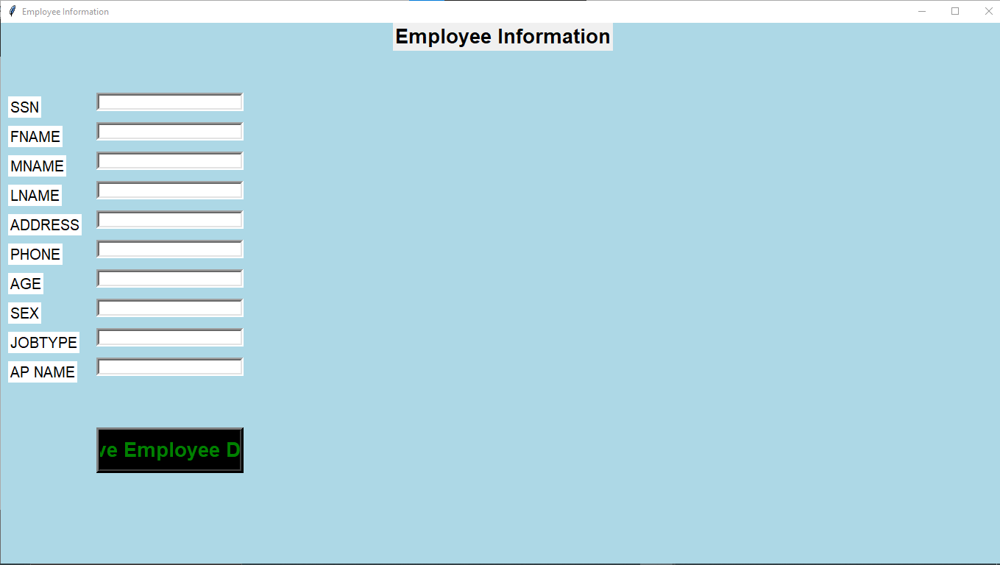

# Airport Management System


## Overview
The **Airport Management System** is a Python-based desktop application with a graphical user interface (GUI) built using Tkinter. It allows users to manage passenger and flight information, ticketing, and employee records, all integrated with a MySQL database backend.

## Features
- Add, view, and delete passenger records
- Manage flight details and ticket bookings
- Employee information management
- Data stored and retrieved from a MySQL database
- User-friendly GUI for efficient workflow

## Prerequisites
- Python 3.x
- MySQL Server
- MySQL Connector for Python
- Tkinter (comes with standard Python installation)

## Setup Instructions
1. **Clone or Download the Repository**
2. **Install Required Python Packages:**
   ```sh
   pip install mysql-connector-python
   ```
3. **Set Up the MySQL Database:**
   - Start your MySQL server.
   - Create a database named `airport_management`.
   - Import the SQL files from the `SQL/` directory to create the necessary tables and sample data.
   - Example using MySQL Workbench:
     - Open each `.sql` file and execute it on the `airport_management` schema.
4. **Configure Database Credentials:**
   - Ensure your MySQL username and password in `airport_management.py` match your local setup.
5. **Run the Application:**
   ```sh
   python airport_management.py
   ```

## Usage
- Use the GUI to add, update, or delete passenger and flight records.
- The Employee Page allows management of employee data.
- All data is stored in the MySQL database for persistence.

## Screenshots

### Main Application Window


### Employee Information Window


## License
This project is for educational purposes.
